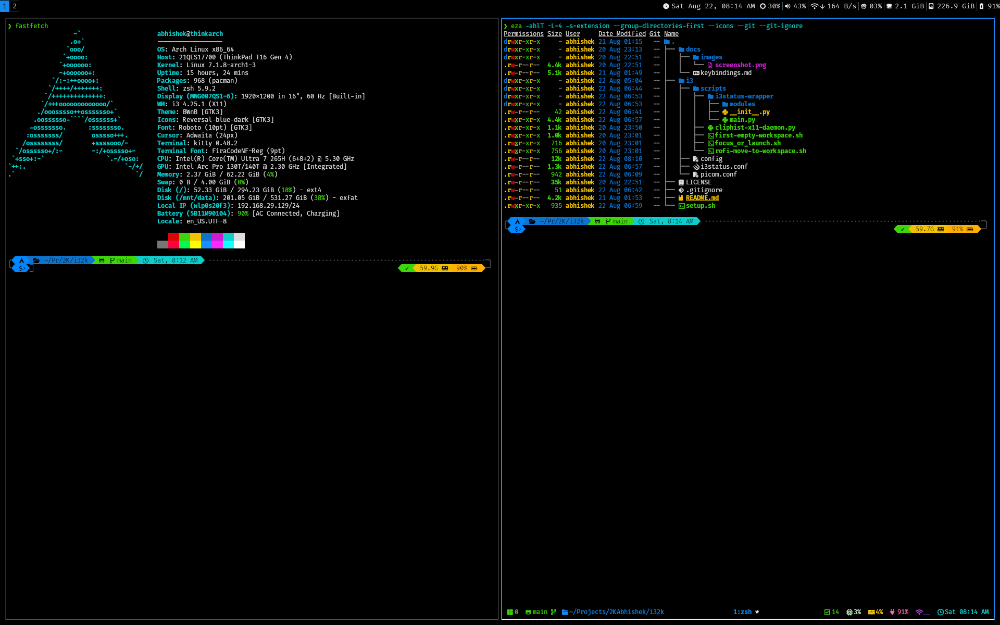

<div align = "center">

<h1><a href="https://github.com/2kabhishek/i3xfce2k">i3xfce2k</a></h1>

<a href="https://github.com/2KAbhishek/i3xfce2k/blob/main/LICENSE">
 </a>

<a href="https://github.com/2KAbhishek/i3xfce2k/graphs/contributors">
 </a>

<a href="https://github.com/2KAbhishek/i3xfce2k/stargazers">
</a>

<a href="https://github.com/2KAbhishek/i3xfce2k/network/members">
 </a>

<a href="https://github.com/2KAbhishek/i3xfce2k/watchers">
 </a>

<a href="https://github.com/2KAbhishek/i3xfce2k/pulse">
 </a>

<h3>Hybrid Tiling Desktop Environment for X11 🎏🛣</h3>

<figure>
  
  <br/>
  <figcaption>i3xfce2k in action</figcaption>
</figure>

</div>

My personalized configs for [i3 window manager](https://i3wm.org/) embedded inside [XFCE Desktop Environment](https://www.xfce.org/) or as a standalone session, minimalistic in design and optimized for developer productivity and speed.

## ✨ Features

- Optimized for keyboard driven CLI workflow with i3 tiling
- Works seamlessly both embedded inside XFCE and as a standalone i3 session
- Full XFCE session management, panel applets, and GTK theme support
- Minimalistic UI, optimized for AMOLED displays
- Customized i3status status bar with modern Nerd Font v3 icons and system modules
- Integrated launcher, emoji picker, window switcher, and clipboard manager via Rofi & cliphist

## ⚡ Setup

### ⚙️ Requirements

Run [setup.sh](setup.sh) to install dependencies on Arch-based systems, or refer to it for manual installation on other distros.

### 💻 Installation

```bash
git clone https://github.com/2kabhishek/i3xfce2k
cd i3xfce2k
./setup.sh
```

#### Recommended Configurations

Highly recommended to use this alongside the following configurations:

- [dots2k](https://github.com/2kabhishek/dots2k) CLI Dev Environment
- [nvim2k](https://github.com/2kabhishek/nvim2k) Personalized Editor
- [rofi2k](https://github.com/2kabhishek/rofi2k) as rofi config
- [sway2k](https://github.com/2kabhishek/sway2k) Wayland Desktop Environment

## 🚀 Usage

### Sessions

- **XFCE + i3 Session (Default)**: Select `XFCE Session` from your login manager. Runs `i3` natively as the window manager with full XFCE panel and session integration.
- **Standalone i3 Session**: Select `i3` from your login manager. Automatically runs independently with background services, `i3bar` + `i3status`, and touchpad controls.

### Keybindings

All the configured keybindings can be found in the [keybinding manual here](./docs/keybindings.md).

## 🧑‍💻 Behind The Code

### 🌈 Inspiration

Needed a light and fast go to setup for my X11 Linux systems.

### 💡 Challenges/Learnings

- Integrating i3 as the native window manager in XFCE's `xfconf` failsafe session
- Preventing `xfdesktop` overlay window conflicts

### 🧰 Tooling

- [dots2k](https://github.com/2kabhishek/dots2k) — Dev Environment
- [nvim2k](https://github.com/2kabhishek/nvim2k) — Personalized Editor
- [sway2k](https://github.com/2kabhishek/sway2k) — Desktop Environment
- [qute2k](https://github.com/2kabhishek/qute2k) — Personalized Browser

### 🔍 More Info

- [sway2k](https://github.com/2kabhishek/sway2k) — Wayland based tiling wm configs
- [dots2k](https://github.com/2kabhishek/dots2k) — Dev Environment

<hr>

<div align="center">

<strong>⭐ hit the star button if you found this useful ⭐</strong><br>

<a href="https://github.com/2KAbhishek/i3xfce2k">Source</a>
| <a href="https://2kabhishek.github.io/blog" target="_blank">Blog </a>
| <a href="https://twitter.com/2kabhishek" target="_blank">Twitter </a>
| <a href="https://linkedin.com/in/2kabhishek" target="_blank">LinkedIn </a>
| <a href="https://2kabhishek.github.io/links" target="_blank">More Links </a>
| <a href="https://2kabhishek.github.io/projects" target="_blank">Other Projects </a>

</div>
